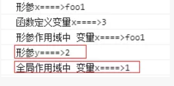
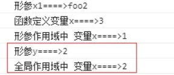
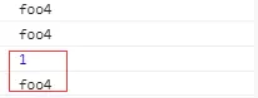

# 深入理解函数作用域之形参作用域

> #### 演示代码

```
<html>
    <body>
        <script type="text/javascript">
        "use strict"
        //复杂的函数作用域
        var x = 1;//定义全局变量x
        //定义了函数参数x，y
        //当形参y为函数时，定义了形参的函数作用域，形参x，y共享同一个作用域空间
        function foo1(
            x,
            y = function() {
                    console.log(`形参作用域中 变量x====>${x}`);
                    x = 2;
                    return x;
                }) {
            console.log(`形参x====>${x}`);
            var x = 3;
            console.log(`函数定义变量x====>${x}`);
            console.log(`形参y====>${y()}`);
        }

        foo1('foo1') // 3
        console.log(`全局作用域中 变量x====>${x}`) // 1

        function foo2(
            x1,
            y = function() {
                    console.log(`形参作用域中 变量x====>${x}`);
                    x = 2;
                    return x;
                }) {
            console.log(`形参x1====>${x1}`);
            var x = 3;
            console.log(`函数定义变量x====>${x}`);
            console.log(`形参y====>${y()}`);
        }

        foo2('foo2') // 3
        console.log(`全局作用域中 变量x====>${x}`) // 1

        function foo3(
            x1,
            y = function() {
                    console.log(`形参作用域中 变量x1====>${x1}`);
                    x1 = 2;
                    return x1;
                }) {
            console.log(`形参x1====>${x1}`);
            //var x1 = 3;
            //console.log(`函数定义变量x1====>${x1}`);
            console.log(`形参y====>${y()}`);
            console.log(`形参x1====>${x1}`);
        }

        foo3('foo3') // 3

        //形参作用域区别于函数作用域，不属于同一空间，
        //当定义重名属性后，函数作用域内属性引用关系改变，但形参作用域内属性不变
        function foo4(x,y=function(){console.log(x)}){
            console.log(x);
            y()
            var x = 1;
            console.log(x);
            y()
        }

        foo4('foo4');

         </script>
    </body>
</html>
```

> 这个例子是参考阮一峰的[ECMAScript 6 入门](http://es6.ruanyifeng.com/#docs/function),思考的是**当函数参数包含匿名函数时变量的引用关系**,我之前也写过一篇[深入理解函数作用域&闭包](https://www.jianshu.com/p/397180d0e66c)，这里对作用域进行补充下，js里面作用域包含根作用域和函数作用域，而参数有实参与形参之分，所以**当形参为函数时，定义了形参的函数作用域，并在函数调用时生成**。根据js变量**由内向外遍历查找原则**，形参作用域内属性优先查找内部变量x，如果没有则往外查找全局x。函数作用域属性也是如此，要注意的是**形参中的函数作用域与函数本身作用域不属于同一空间**，函数作用域内属性值的改变不会影响形参作用域内同名属性

> #### 当全局作用域、形参作用域、函数作用域有同名属性时会如何影响？

```
function foo1(
    x,
    y = function() {
            console.log(`形参作用域中 变量x====>${x}`);
            x = 2;
            return x;
        }) {
    console.log(`形参x====>${x}`);
    var x = 3;
    console.log(`函数定义变量x====>${x}`);
    console.log(`形参y====>${y()}`);
}

foo1('foo1') // 3
console.log(`全局作用域中 变量x====>${x}`) // 1
```

> 

> #### 形参作用域访问并可以修改全局作用域属性

```
function foo2(
    x1,
    y = function() {
            console.log(`形参作用域中 变量x====>${x}`);
            x = 2;
            return x;
        }) {
    console.log(`形参x1====>${x1}`);
    var x = 3;
    console.log(`函数定义变量x====>${x}`);
    console.log(`形参y====>${y()}`);
}

foo2('foo2') // 3
console.log(`全局作用域中 变量x====>${x}`) // 1
```

> 

> #### 形参作用域内属性可以被其作用域内函数修改

```
function foo3(
    x1,
    y = function() {
            console.log(`形参作用域中 变量x1====>${x1}`);
            x1 = 2;
            return x1;
        }) {
    console.log(`形参x1====>${x1}`);
    //var x1 = 3;
    //console.log(`函数定义变量x1====>${x1}`);
    console.log(`形参y====>${y()}`);
    console.log(`形参x1====>${x1}`);
}

foo3('foo3') // 3
```

> 

> #### 形参中的函数作用域与函数本身作用域不属于同一空间，当定义重名属性后，函数作用域内属性引用关系改变，但形参作用域内属性不会被改变

```
function foo4(x,y=function(){console.log(x)}){
    console.log(x);
    y()
    var x = 1;
    console.log(x);
    y()
}

foo4('foo4');
```

> 

